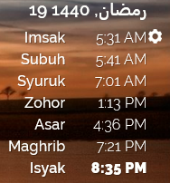

Waqtu Rainmeter Prayer Time Skin
======================================

Features
--------

This skin basically will parse the prayer times data for the chosen zone code in Malaysia from the [JAKIM](https://www.e-solat.gov.my) website every 24 hours:
- The current prayer time is also highlighted
- The user can choose to view the prayer times in either 12- or 24-hour format.
- The developer/maintainer can enable debug mode by setting the variable Debug=1

Requirements
------------

Latest version of Rainmeter 4.3+. Download [Rainmeter](https://rainmeter.net)

Requires Raleway True-Type font suite. Download [Raleway](https://fonts.google.com/specimen/Raleway).

Installation
------------

1. Extract Waqtu into %USERPROFILE%\Documents\Rainmeter\Skins
2. Run Rainmeter and Manage Rainmeter
3. Click Refresh All button if Waqtu is not in the list
4. Expand Waqtu folder, choose the Prayer Time and Hijri Date skin and click Load Skin button

Usage
-----
Using the skin is fairly straightforward. But just in case here is a short video demonstration on how to install and use the skin.

1. Click on the setting button to edit the URL
2. Find the zone code for your city from the JAKIM website (there is a list in the setting, anyway)
3. Replace the ZoneCode in the setting
4. Right click on the skin and Refresh Skin

License
=======

[Creative Commons Attribution 4.0 International (CC BY-NC-SA 4.0)](https://creativecommons.org/licenses/by-nc-sa/4.0/).

Changelog
---------

**Version 1.1.0 – 26/05/2019**
- Corrected the issue with current time not keep updating
- Corrected the issue with the current prayer time detection
- Introduced notificatios about the connection problems
- Made the current hour format persistent on the next reload
- Added more logs for debugging
- Change the folder name Config into @Resources to comply with Rainmeter's recommended location to improve its initial load time

**Version 1.0.0 – 22/05/2019**
- Added to Github (forked Adlan Khalidi's Waqtu Rainmeter skin to use the JAKIM Malaysia prayer times database instead)