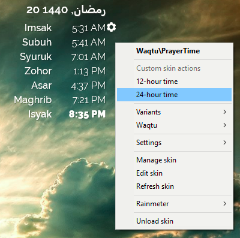

# 🚧 Under Development
Currently developing with the **Kemenag RI** database version. Please ⭐️ this repository if you find it useful or would like to see it completed.

Waqtu Rainmeter Prayer Time Skin
================================

Features
--------

This skin basically will parse the prayer times data for the chosen zone code in Malaysia from the [JAKIM](https://www.e-solat.gov.my) website every 24 hours:
- The skin will highlight the current prayer time and sound the alarm when it matches the current time
- The user can choose to view the prayer times in either 12- or 24-hour format
- The user can set the Hijri offset by setting the variable HijriOffset in day increment/decrement
- The developer/maintainer can enable debug mode by setting the variable Debug=1

Requirements
------------

The latest version of Rainmeter 4.3+. Download [Rainmeter](https://rainmeter.net)

It requires Chameleon Rainmeter plugin. Download [Chameleon](https://software.socksthefox.net/chameleon/)

It also requires Raleway True-Type font suite. Download [Raleway](https://fonts.google.com/specimen/Raleway)

Installation
------------

1. Extract Waqtu into %USERPROFILE%\Documents\Rainmeter\Skins folder (for the default Windows installation)
2. Run Rainmeter and Manage Rainmeter
3. Click Refresh All button if Waqtu is not in the list
4. Expand Waqtu folder, choose the Prayer Time and Hijri Date skin and click Load Skin button

When in doubt, please refer to the Rainmeter's guide on how to install and use a skin

Usage
-----

Using the skin is fairly straightforward.

1. Click on the setting button to edit the URL
2. Find the ZoneCode for your city from the JAKIM website (there is a list in the setting, anyway)
3. Replace the ZoneCode in the setting
4. Right click on the skin and Refresh Skin

Please be careful not to accidentally change the provided URL template

License
-------

[Creative Commons Attribution 4.0 International (CC BY-NC-SA 4.0)](https://creativecommons.org/licenses/by-nc-sa/4.0/).

Changelog
---------

**Version 1.9.0 – 20/07/2019**
- The Hijri offset could be simply set by setting the HijriOffset variable in day increment/decrement
- Provided the setting icon for the Date skin to easily access the HijriOffset variable

**Version 1.8.0 – 04/07/2019**
- Offset the Hijri date by -1 day to streamline with the Hijri calendar in Malaysia

**Version 1.7.0 – 02/06/2019**
- Deprecated the old regex pattern; the new regex pattern could retrieve both the prayer names and the prayer times respectively to be used in the meters
- Set DefaultUpdateDivider=5 in [Rainmeter] section for the PrayerTime.ini script to give enough time for the new regex pattern to extract the data from the URL
- Set DefaultUpdateDivider=3600 in [Rainmeter] section for the Date.ini script to slow down the update

**Version 1.6.0 – 28/05/2019**
- Played the alarm sound only when the current prayer time matches the current time

**Version 1.5.0 – 27/05/2019**
- Played the alarm sound stored in the @Resources/Sounds folder when the current prayer time updated
- Redesigned the skin layout to take into account the skin dimension
- Redesigned the skin styles
- Properly hidden the database connection notification when there was no Internet connection

**Version 1.4.0 – 26/05/2019**
- Corrected the issue with the current prayer time detection by adding the case for the late isya when the current time > midnight but the current time < the imsak time
- Applied the Chameleon Rainmeter plugin to blend the styles seamlessly with the current desktop wallpaper

**Version 1.3.0 – 25/05/2019**
- Regression: set DoNotOverrideHiddenNonDebug=1 to hide the debug meters
- Implemented different styles for debug meters and notifications

**Version 1.2.0 – 25/05/2019**
- Corrected the issue with the current prayer time detection by removing the date component from the current time to get the correct timestamp to compare with each prayer time

**Version 1.1.0 – 25/05/2019**
- Corrected the issue with the current time not keep updating
- Corrected the issue with the current prayer time detection
- Introduced notifications about the connection problems
- Made the current hour format persistent on the next reload
- Added more logs for debugging
- Change the folder name Config into @Resources to comply with Rainmeter's recommended location to improve its initial load time

**Version 1.0.0 – 22/05/2019**
- Added to GitHub (forked Adlan Khalidi's Waqtu Rainmeter skin to use the JAKIM Malaysia prayer times database instead)
